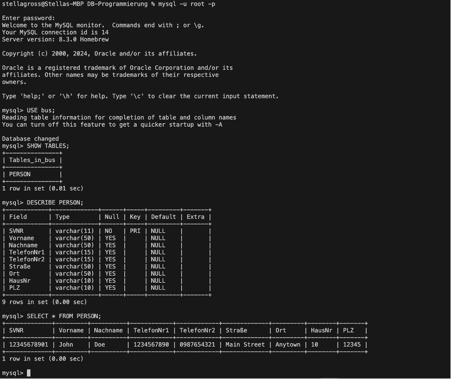
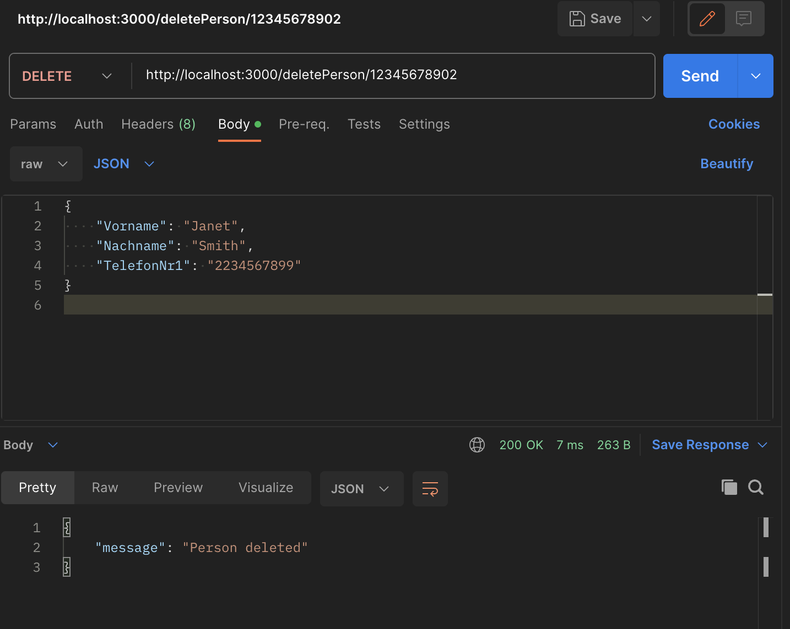

## Documentation:

# Prerequisites
- Visual Studio Code
- Node.js and npm
- Homebrew (for macOS users)
- MySQL

## Step 1: Install Node.js and npm
1. **Download and Install Node.js**:
   - Visit [nodejs.org](https://nodejs.org) and download the LTS version.
   - Follow the installation instructions for your operating system.
2. **Verify Installation**: Open a terminal and run:
   ```bash
   node -v
   npm -v


**Step 2: Install MySQL**

**For macOS users:**

1.  **Install Homebrew:** If you don't have Homebrew installed, install it by running:
    

/bin/bash -c "$(curl -fsSL https://raw.githubusercontent.com/Homebrew/install/HEAD/install.sh)"

1.  **Install MySQL:**
    ```bash
    brew install mysql

1.  **Start MySQL Service:**
    
    ```bash
    brew services start mysql

**For Windows users:**

1.  **Download and Install MySQL:**
    
    *   Visit [dev.mysql.com](https://dev.mysql.com/downloads/installer/) and download the MySQL Installer.
        
    *   Follow the installation instructions, making sure to install the MySQL Server.
        
2.  **Start MySQL Service:**
    
    *   Start the MySQL service from the Windows Services app.
        

**Step 3: Secure MySQL Installation**

1.  **Run the MySQL Secure Installation Script:**
    
    ```bash
    mysql\_secure\_installation

1.  **Set the Root Password:** Follow the prompts to set a root password and apply security settings. Remember the password you set, as you'll need it later.
    

**Step 4: Create a Database**

1.  **Log into MySQL:**
    
    ```bash
    mysql -u root -p

Enter the root password when prompted.

1.  **Create a New Database:**
    
    ```bash
    CREATE DATABASE bus;
1.  **Create Tabel Person**
    ```bash
    mysql> CREATE TABLE PERSON (
    ->     SVNR VARCHAR(11) PRIMARY KEY,
    ->     Vorname VARCHAR(50),
    ->     Nachname VARCHAR(50),
    ->     TelefonNr1 VARCHAR(15),
    ->     TelefonNr2 VARCHAR(15),
    ->     Straße VARCHAR(50),
    ->     Ort VARCHAR(50),
    ->     HausNr VARCHAR(10),
    ->     PLZ VARCHAR(10)
    -> );   

1.  **Exit MySQL:**
    ```bash
    EXIT;

**Step 5: Set Up Visual Studio Code**

1.  **Initialize a Node.js Project:**
    
    ```bash
    npm init -y

1.  **Install Necessary Packages:**
    
    ```bash
    npm install express mysql body-parser


**Step 6: Run and Test the Application**

1.  **Start the Server:** In the terminal, run:
    
    ```bash 
    node server.js

1.  **Verify the Server:** Open a web browser and navigate to http://localhost:3000. You should see the message "Welcome to the Database Project!".


### CHECK:
**CHECK IF IN DATABASE:**


    mysql -u root -p

    USE bus;

    SHOW TABLES;

    DESCRIBE PERSON;

    SELECT \* FROM PERSON;





## Example on how to Check in Postman and SQL Database: 

#### 1. **Create a New Person (POST)**

1.  **Open Postman and create a new request.**
    
2.  **Set the request method to POST.**
    
3.  **Enter the URL:** http://localhost:3000/addPerson
    
4.  **Select the Body tab.**
    
5.  **Select raw and JSON format.**
    
6. `   jsonCopy code{ "SVNR": "12345678902", "Vorname": "Jane", "Nachname": "Smith", "TelefonNr1": "2234567890", "TelefonNr2": "1987654321", "Straße": "Second Street", "Ort": "Anytown", "HausNr": "11", "PLZ": "54321"} `
    
7.  **Click Send.**
    

**Expected Result:** You should see a response like:

`   jsonCopy code{      "message": "Person added",      "SVNR": "12345678902"  }   `

#### 2. **Read All Persons (GET)**

1.  **Create a new request in Postman.**
    
2.  **Set the request method to GET.**
    
3.  **Enter the URL:** http://localhost:3000/getPersons
    
4.  **Click Send.**
    

**Expected Result:** You should see a response with a list of persons, including the one you just added:

`   jsonCopy code[      {          "SVNR": "12345678901",          "Vorname": "John",          "Nachname": "Doe",          "TelefonNr1": "1234567890",          "TelefonNr2": "0987654321",          "Straße": "Main Street",          "Ort": "Anytown",          "HausNr": "10",          "PLZ": "12345"      },      {          "SVNR": "12345678902",          "Vorname": "Jane",          "Nachname": "Smith",          "TelefonNr1": "2234567890",          "TelefonNr2": "1987654321",          "Straße": "Second Street",          "Ort": "Anytown",          "HausNr": "11",          "PLZ": "54321"      }  ]   `

#### 3. **Update a Person (PUT)**

1.  **Create a new request in Postman.**
    
2.  **Set the request method to PUT.**
    
3.  **Enter the URL:** http://localhost:3000/updatePerson/12345678902
    
4.  **Select the Body tab.**
    
5.  **Select raw and JSON format.**
    
6.  `jsonCopy code{ "Vorname": "Janet", "Nachname": "Smith", "TelefonNr1": "2234567899"}  `
    
7.  **Click Send.**


## Postman example:




**Expected Result:** You should see a response like:

`   jsonCopy code{      "message": "Person updated"  }   `

#### 4. **Delete a Person (DELETE)**

1.  **Create a new request in Postman.**
    
2.  **Set the request method to DELETE.**
    
3.  **Enter the URL:** http://localhost:3000/deletePerson/12345678902
    
4.  **Click Send.**
    

**Expected Result:** You should see a response like:
`   jsonCopy code{      "message": "Person deleted"  }   `

#### 5. **Verify the Operations**

1.   ` codemysql -u root -p `
    
2.  ` USE bus; `
    
3.  **Verify the PERSON Table After Each Operation:**
    
    *   SELECT \* FROM PERSON WHERE SVNR = '12345678902'; //You should see the new person record.
        
    *   SELECT \* FROM PERSON;  //You should see all person records, including the new one.
        
    *   SELECT \* FROM PERSON WHERE SVNR = '12345678902'; //You should see the updated details for the person.
        
    *   ELECT \* FROM PERSON WHERE SVNR = '12345678902'; //You should not see any record for 12345678902.
        

### Summary of SQL Verification

*   SELECT \* FROM PERSON WHERE SVNR = '12345678902';
    
*   SELECT \* FROM PERSON;
    
*   SELECT \* FROM PERSON WHERE SVNR = '12345678902';
    
*   SELECT \* FROM PERSON WHERE SVNR = '12345678902';